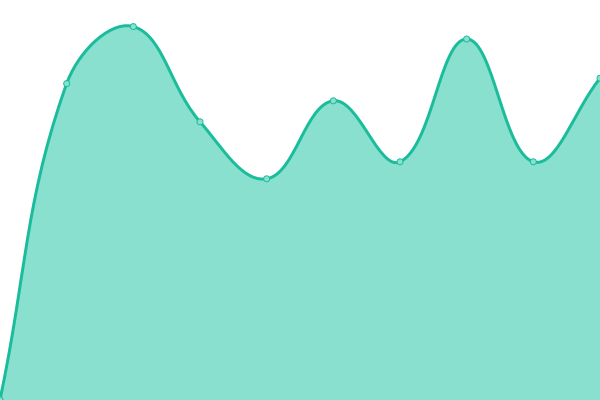

# [📈 Live Status](https://BSrE-ID.github.io/monitor): <!--live status--> **🟧 Partial outage**

This repository contains the open-source uptime monitor and status page for [BSrE-ID](https://BSrE-ID.github.io/monitor), powered by [Upptime](https://github.com/upptime/upptime).

With [Upptime](https://upptime.js.org), you can get your own unlimited and free uptime monitor and status page, powered entirely by a GitHub repository. We use [Issues](https://github.com/BSrE-ID/monitor/issues) as incident reports, [Actions](https://github.com/BSrE-ID/monitor/actions) as uptime monitors, and [Pages](https://BSrE-ID.github.io/monitor) for the status page.

<!--start: status pages-->
<!-- This summary is generated by Upptime (https://github.com/upptime/upptime) -->
<!-- Do not edit this manually, your changes will be overwritten -->
<!-- prettier-ignore -->
| URL | Status | History | Response Time | Uptime |
| --- | ------ | ------- | ------------- | ------ |
|  [Laman Umum BSrE](https://bsre.bssn.go.id) | 🟥 Down | [laman-umum-b-sr-e.yml](https://github.com/BSrE-ID/monitor/commits/HEAD/history/laman-umum-b-sr-e.yml) | 

 535ms
     
 | 

<a href="https://BSrE-ID.github.io/monitor/history/laman-umum-b-sr-e">30.13%</a>
    

|  [Laman AMS BSrE](https://portal-bsre.bssn.go.id/login) | 🟩 Up | [laman-ams-b-sr-e.yml](https://github.com/BSrE-ID/monitor/commits/HEAD/history/laman-ams-b-sr-e.yml) | 

 1105ms
     
 | 

<a href="https://BSrE-ID.github.io/monitor/history/laman-ams-b-sr-e">94.76%</a>
    

|  [API BSrE](https://api-bsre.bssn.go.id) | 🟩 Up | [api-b-sr-e.yml](https://github.com/BSrE-ID/monitor/commits/HEAD/history/api-b-sr-e.yml) | 

 939ms
     
 | 

<a href="https://BSrE-ID.github.io/monitor/history/api-b-sr-e">99.62%</a>
    

|  [eSign BSrE](https://esign-bsre.bssn.go.id/login) | 🟥 Down | [e-sign-b-sr-e.yml](https://github.com/BSrE-ID/monitor/commits/HEAD/history/e-sign-b-sr-e.yml) | 

 0ms
     
 | 

<a href="https://BSrE-ID.github.io/monitor/history/e-sign-b-sr-e">0.00%</a>
    

|  [Repo BSrE](https://gitlab-bsre.bssn.go.id/users/sign_in) | 🟥 Down | [repo-b-sr-e.yml](https://github.com/BSrE-ID/monitor/commits/HEAD/history/repo-b-sr-e.yml) | 

 0ms
     
 | 

<a href="https://BSrE-ID.github.io/monitor/history/repo-b-sr-e">0.00%</a>
    

|  [File BSrE](https://file-bsre.bssn.go.id/login) | 🟥 Down | [file-b-sr-e.yml](https://github.com/BSrE-ID/monitor/commits/HEAD/history/file-b-sr-e.yml) | 

 0ms
     
 | 

<a href="https://BSrE-ID.github.io/monitor/history/file-b-sr-e">0.00%</a>
    

<!--end: status pages-->

[**Visit our status website →**](https://BSrE-ID.github.io/monitor)

## 📄 License

- Powered by: [Upptime](https://github.com/upptime/upptime)
- Code: [MIT](./LICENSE) © [BSrE-ID](https://BSrE-ID.github.io/monitor)
- Data in the `./history` directory: [Open Database License](https://opendatacommons.org/licenses/odbl/1-0/)
